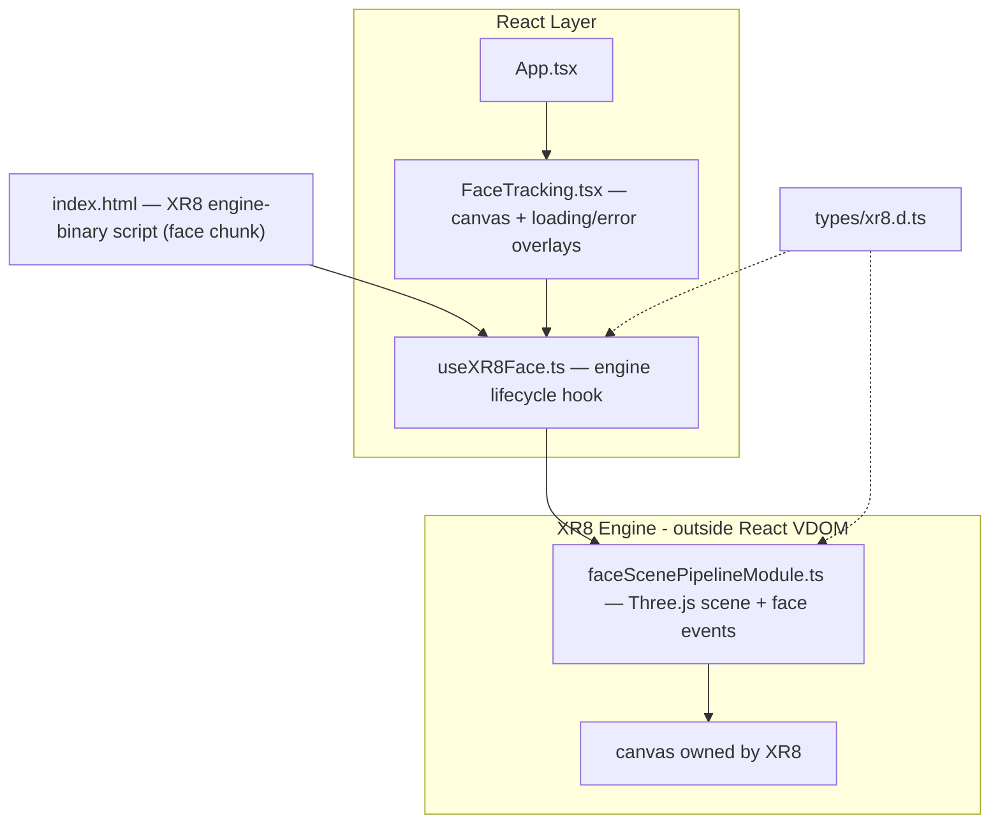

# 01 — 8th Wall Face Tracking App: Implementation Plan

**Stack:** React 18 + Vite + TypeScript + Three.js (npm) + 8th Wall XR8 Engine Binary (Face Effects)

**What you get at the end:** you run `npm run dev`, open the browser, allow the camera, and the app tracks your face live — procedural 3D glasses and a nose sphere stick to your face and follow it. Denying the camera shows a friendly error with Retry. Closing/unmounting fully releases the webcam.

All API calls below were verified against the current 8thwall.org docs (Feb 2026 open-source release).

---

## Architecture



| File | Single responsibility |
|---|---|
| `src/hooks/useXR8Face.ts` | Engine lifecycle: load, configure, run, stop, cleanup |
| `src/lib/faceScenePipelineModule.ts` | 3D scene content + face event handling |
| `src/components/FaceTracking.tsx` | Presentation: canvas, loading/error overlays |
| `src/types/xr8.d.ts` | XR8 global type definitions |

---

## STEP 1 — Scaffold the project

**Actions:**

1. In the workspace root run:
   ```bash
   npm create vite@latest . -- --template react-ts
   npm install
   npm install three @types/three @8thwall/engine-binary
   ```
2. Add the engine script to `index.html` `<head>` (must remain unmodified — this satisfies the binary license):
   ```html
   <script src="https://cdn.jsdelivr.net/npm/@8thwall/engine-binary@1/dist/xr.js"
           async crossorigin="anonymous" data-preload-chunks="face"></script>
   ```
3. Delete Vite demo boilerplate (logos, counter, demo CSS).

**Files touched:** `package.json`, `index.html`, `src/*` cleanup.

**Done when:** `npm run dev` serves a blank page and the Network tab shows `xr.js` + the `face` chunk loading.

---

## STEP 2 — TypeScript definitions for the XR8 global

**Actions:** create `src/types/xr8.d.ts` declaring:

1. `window.XR8` and the `CameraPipelineModule` shape (`name`, `onStart`, `onUpdate`, `onCameraStatusChange`, `onException`, `listeners`).
2. The API surface we use (verified names):
   - `XR8.addCameraPipelineModules` / `clearCameraPipelineModules` / `run` / `stop`
   - `XR8.GlTextureRenderer.pipelineModule()`
   - `XR8.Threejs.pipelineModule()` / `XR8.Threejs.xrScene()`
   - `XR8.FaceController.pipelineModule()` / `configure()` / `AttachmentPoints` / `MeshGeometry`
   - `XR8.XrConfig.camera()` (`FRONT`) / `XR8.XrConfig.device()` (`ANY`)
3. Face event detail type: `{ id, transform: { position, rotation, scale, scaledWidth, scaledHeight, scaledDepth }, attachmentPoints: Record<string, { position: {x, y, z} }> }`.

**Done when:** the project compiles with no `any` leaking into app code.

---

## STEP 3 — Face scene pipeline module (the 3D content)

**Actions:** create `src/lib/faceScenePipelineModule.ts`, a factory returning `{ module, dispose }`.

1. `onStart`: get `{ scene, camera, renderer }` from the custom three.js module's `xrScene()`; add hemisphere + directional light; add a hidden `faceGroup` containing:
   - an emissive sphere at the `NOSE_TIP` attachment point,
   - procedural glasses (two torus rings + bridge bar) placed via `LEFT_EYE` / `RIGHT_EYE` attachment points.
   - All geometry procedural — **no asset files needed**.
2. `listeners` (verified event names and payloads):
   ```ts
   listeners: [
     { event: 'facecontroller.facefound',   process: onFaceUpdate },
     { event: 'facecontroller.faceupdated', process: onFaceUpdate },
     { event: 'facecontroller.facelost',    process: onFaceLost },
   ]
   ```
   `onFaceUpdate` shows `faceGroup`, copies `detail.transform` (position / rotation quaternion / scale) onto it, and repositions children from `detail.attachmentPoints`. `onFaceLost` hides the group.
3. First `onUpdate` tick fires an `onFirstFrame` callback so React can dismiss the loading overlay exactly when the camera feed becomes visible.
4. `onCameraStatusChange({ status })`: `'failed'` → report camera-permission error. `onException(error)` → report engine error.
5. `dispose()`: dispose all geometries/materials, remove `faceGroup` from the scene.

**Done when:** module is pure TypeScript (no React imports) and fully disposable.

---

## STEP 4 — Engine lifecycle hook

**Actions:** create `src/hooks/useXR8Face.ts` returning `{ status, error }`, `status: 'loading' | 'running' | 'error'`.

1. Resolve the engine with the npm helper (cleaner than a manual `xrloaded` listener):
   ```ts
   import { XR8Promise } from '@8thwall/engine-binary'
   const XR8 = await XR8Promise  // resolves once the script tag has loaded
   ```
   Wrap with a timeout → "AR engine failed to load" error state.
2. Startup, guarded by a cancellation flag (XR8 is a global singleton — React 18 StrictMode double-invoke must not call `run()` twice):
   ```ts
   XR8.FaceController.configure({
     meshGeometry: [XR8.FaceController.MeshGeometry.FACE],
     coordinates: { mirroredDisplay: true, axes: 'RIGHT_HANDED' },  // selfie mirror
   })
   XR8.clearCameraPipelineModules()
   XR8.addCameraPipelineModules([
     XR8.GlTextureRenderer.pipelineModule(),   // 1. draws camera feed
     threejs.module,                           // 2. custom three.js module (see note below)
     XR8.FaceController.pipelineModule(),      // 3. face detection + events
     faceScene.module,                         // 4. our content (after threejs → xrScene() works)
   ])
   XR8.run({
     canvas,
     cameraConfig: { direction: XR8.XrConfig.camera().FRONT },
     allowedDevices: XR8.XrConfig.device().ANY,  // desktop webcam + mobile
   })
   ```
   Notes discovered during implementation (as built):
   - The engine's built-in `XR8.Threejs.pipelineModule()` crashes with only the `face` chunk loaded — it calls `XrController.updateCameraProjectionMatrix()` at startup, and `XrController` only exists in the SLAM chunk. We therefore use a **custom Three.js pipeline module** (`src/lib/threejsPipelineModule.ts`, based on 8th Wall's official `customThreejsPipelineModule` example) built on our npm three. It drives the camera from `processCpuResult.facecontroller` (per-frame `intrinsics`, `rotation`, `position`).
   - With our right-handed three.js camera, `axes` must be `'RIGHT_HANDED'` (`LEFT_HANDED` puts the face behind the camera; it is only correct with the engine's built-in Threejs module).
   - The canvas attribute size must be synced to the viewport (`canvas.width/height = clientWidth/Height × devicePixelRatio`) before `run()` and on resize, otherwise the feed renders at the default 300×150 and looks zoomed/cropped.
   - Verified constraint: `FaceController` cannot be used together with `XrController` (SLAM) — we never add that module.
3. Error mapping: camera `'failed'` → "Camera access denied or unavailable"; exception → "AR engine failed to initialize".
4. Cleanup on unmount, strict order: set cancelled flag → `XR8.stop()` (releases the webcam) → `XR8.clearCameraPipelineModules()` → `faceScene.dispose()`.

**Done when:** mount starts the camera; unmount turns the webcam LED off; StrictMode double-mount is safe.

---

## STEP 5 — React component + UI

**Actions:** create `src/components/FaceTracking.tsx` + `FaceTracking.css`, wire into `App.tsx`.

1. `<canvas ref={canvasRef} />` owned entirely by XR8 — React never re-renders inside it.
2. Overlays as siblings, driven by hook status:
   - `loading`: spinner + "Starting camera…"
   - `error`: message per error kind + Retry button (remounts via `key` bump).
3. CSS: full-viewport wrapper `position: relative; overflow: hidden`; canvas `width/height: 100%; display: block`.

**Done when:** loading overlay → camera prompt → live mirrored feed with glasses stuck to your face.

---

## STEP 6 — Verify end-to-end

1. `npm run build` passes with zero type errors.
2. `npm run dev`, open the browser:
   - loading overlay appears, then the camera permission prompt,
   - allow → live camera feed, glasses + sphere track your face, hide when you leave frame,
   - deny → error UI, Retry works after re-allowing,
   - navigate away / unmount → webcam light goes off.

---

## Risks & fallbacks

- **Three.js version coupling — happened, fallback applied:** the engine's `Threejs.pipelineModule()` turned out to require the SLAM chunk at startup, so the documented fallback (a custom Three.js pipeline module built entirely on our npm three, per the official `customThreejsPipelineModule` example) is what shipped. Everything else in Step 4 was unchanged.
- **HTTPS:** camera works on `localhost` out of the box; for phone/LAN testing add `@vitejs/plugin-basic-ssl`.
- **License:** serve `xr.js` unmodified (copyright header visible in devtools). No account or app key required.
- **Maintenance:** the engine binary is maintained as-is by Niantic Spatial; Face Effects also exists MIT-licensed in the open-source framework if we ever need to self-build.
