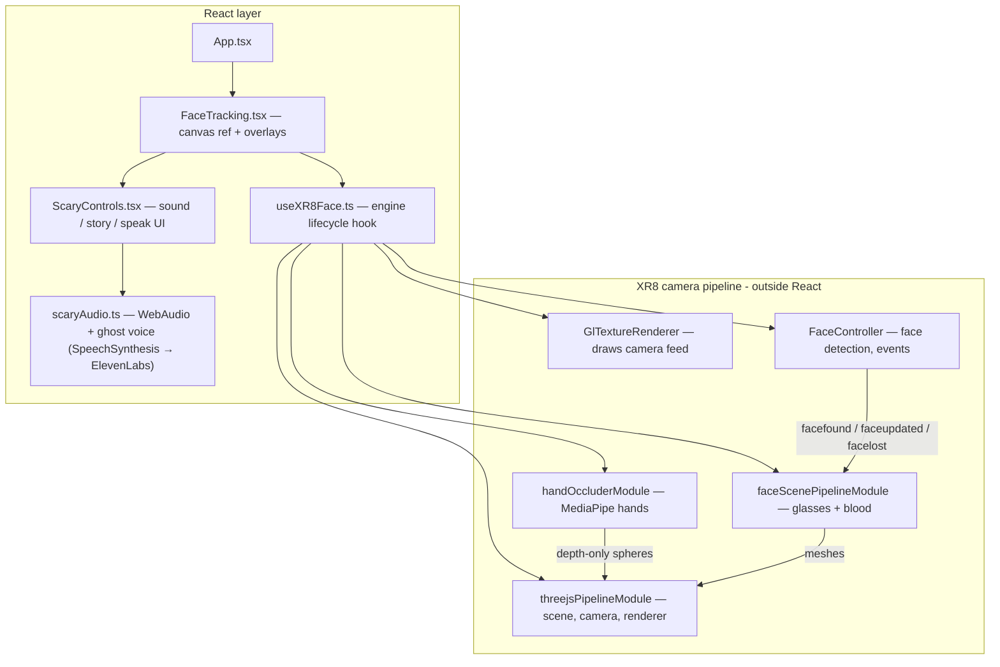

# 02 — What Was Built and How It Works

A WebAR horror face-filter app that runs entirely in the browser: no app install, no account. You open the page, allow the camera, and it tracks your face live — virtual glasses, blood running out of your mouth, real-hand occlusion, a scary ambient soundscape, and a cinematic ghost voice that narrates a story or reads any text you type.

**Stack:** React 18 + Vite + TypeScript + Three.js (npm) + 8th Wall XR8 Engine Binary (Face Effects, free since Feb 2026) + MediaPipe HandLandmarker + Web Audio API + browser SpeechSynthesis (upgrade path: cloud TTS via ElevenLabs).

---

## Features

| Feature | How it looks |
|---|---|
| Face tracking | Virtual glasses lock onto your eyes and follow your head |
| Blood effect | Blood streaks grow out of your lower lip; droplets detach, fall, sway, and fade |
| Hand occlusion | Cover your mouth/eyes with your hand — the virtual content hides behind your real hand |
| Ambient sound | Low detuned drone + wind + heartbeat, generated procedurally (no audio files) |
| Ghost voice | Type text and it is read in a deep, slowed, cinematic ghost voice |
| Story narration | "Tell the story" reads `story/yerevarn.md` as a real, wavering ghost narrator with dramatic pauses |
| Loading / error UI | Spinner while starting; friendly error + Retry if the camera is denied or the engine fails |

---

## Project structure

```
XR/
├── index.html                          # Vite entry + the ONE external script:
│                                       #   8th Wall engine binary (face chunk preloaded)
├── vite.config.ts                      # React plugin (+ note: basic-ssl for phone testing)
├── package.json                        # react, three, @mediapipe/tasks-vision
├── story/
│   └── yerevarn.md                     # The story the ghost narrates (edit freely)
├── docs/
│   ├── 01-8thwall-face-tracking-plan.md  # Original implementation plan
│   └── 02-how-it-works.md              # This file
└── src/
    ├── main.tsx                        # React root (StrictMode)
    ├── App.tsx                         # Renders <FaceTracking />
    ├── index.css                       # Full-viewport reset
    ├── vite-env.d.ts                   # Vite client types (?raw imports, import.meta.env)
    ├── types/
    │   └── xr8.d.ts                    # TypeScript definitions for the XR8 global
    ├── hooks/
    │   └── useXR8Face.ts               # Engine lifecycle: load → configure → run → cleanup
    ├── lib/
    │   ├── loadXR8.ts                  # Resolves the XR8 global (script loads async)
    │   ├── threejsPipelineModule.ts    # Custom Three.js scene/camera/renderer module
    │   ├── faceScenePipelineModule.ts  # Glasses + blood content, face event handling
    │   ├── handOccluderModule.ts       # MediaPipe hand tracking → depth-only occluder
    │   └── scaryAudio.ts               # Ambient soundscape + cinematic ghost voice + story narrator
    └── components/
        ├── FaceTracking.tsx            # Canvas (owned by XR8) + loading/error overlays
        ├── FaceTracking.css
        ├── ScaryControls.tsx           # Bottom bar: sound toggle, story button, text-to-speech
        └── ScaryControls.css
```

Each file has one responsibility; React never touches what the AR engine owns, and the AR modules never import React.

---

## Architecture



Every camera frame flows through the pipeline modules in order: the camera feed is drawn first, then face detection runs and fires events, then the Three.js scene (glasses, blood, hand occluders) is rendered on top.

---

## How each part works

### 1. Engine loading (`index.html` + `loadXR8.ts`)

The only external script is the 8th Wall engine binary from CDN with the face chunk preloaded:

```html
<script src="https://cdn.jsdelivr.net/npm/@8thwall/engine-binary@1/dist/xr.js"
        async crossorigin="anonymous" data-preload-chunks="face"></script>
```

It loads async and exposes a global `XR8` object. `loadXR8.ts` resolves it either immediately or via the `xrloaded` event, with a timeout that surfaces a friendly error. No app key or account is needed; the script must stay unmodified per its license.

### 2. Engine lifecycle (`hooks/useXR8Face.ts`)

A React hook that returns `{ status, error }` (`loading | running | error`). On mount it:

1. Waits for `XR8`.
2. Configures the face controller: `mirroredDisplay: true` (selfie mirror) and `axes: 'RIGHT_HANDED'` (matches our Three.js camera).
3. Sizes the canvas buffer to the container × devicePixelRatio (measuring the **container**, never the canvas — the engine writes inline pixel styles to the canvas, so measuring it creates a feedback loop that doubles the size on every remount; that bug shipped once as an extreme "zoom").
4. Registers the pipeline modules in order and calls `XR8.run()` with the front camera.

On unmount it runs a strict cleanup: `XR8.stop()` (releases the webcam), clear pipeline modules, dispose all Three.js resources. A cancellation flag makes React 18 StrictMode's double-mount safe — the engine is a global singleton and must never be started twice.

Error paths: camera permission denied → "Camera unavailable" + Retry; engine failure → "AR failed to start" + Retry. Retry remounts everything via a React `key` bump.

### 3. Custom Three.js module (`lib/threejsPipelineModule.ts`)

The engine's built-in `XR8.Threejs.pipelineModule()` crashes when only the `face` chunk is loaded (it requires the SLAM chunk at startup). So this project uses a custom module — based on 8th Wall's official `customThreejsPipelineModule` example — that creates the scene/camera/renderer from our own npm Three.js and drives the camera each frame from the face controller's per-frame `intrinsics` (projection matrix), `rotation`, and `position`.

### 4. Face content (`lib/faceScenePipelineModule.ts`)

Listens to the engine's face events:

- `facecontroller.facefound` / `faceupdated` → copy the face transform (position, quaternion, scale) onto a `faceGroup`, then place each object at its **attachment point** (`leftEye`, `rightEye`, `lowerLip`, `mouthLeftCorner`, `mouthRightCorner`…).
- `facecontroller.facelost` → hide everything.

Content (all procedural geometry, zero asset files):

- **Glasses** — two torus rings at the eyes + a box bridge, sized relative to the eye distance so they fit any face at any camera distance.
- **Blood streaks** — a texture painted at runtime on a 2D canvas (a pool on the lip + five uneven streaks ending in droplet blobs), mapped onto a plane anchored to the lower lip. It scales with mouth width and "grows" out of the mouth over the first ~2 seconds.
- **Falling droplets** — five small spheres on staggered loops: they detach below the lip, accelerate as they fall, sway slightly, shrink, and fade out.

### 5. Hand occlusion (`lib/handOccluderModule.ts`)

The face engine has no idea hands exist, so a second tracker fills the gap:

1. **MediaPipe HandLandmarker** runs on the same `<video>` element the engine uses, detecting up to 2 hands × 21 joints per camera frame.
2. Each joint gets a sphere with `colorWrite: false` — it writes **only to the depth buffer**, never to the screen. 23 extra midpoint spheres along the finger bones and across the palm keep the mask gap-free while staying tight to the hand silhouette (per-joint tuned radii: fingertips smallest, wrist largest).
3. The spheres are placed slightly in front of the tracked face in 3D. When the glasses or blood try to draw behind them they fail the depth test, so the real camera pixels — your hand — show through. That is the standard AR occluder trick.

Mapping landmarks to 3D accounts for the engine's cover-fit crop of the video onto the canvas and the mirrored selfie display, then unprojects through the camera to a fixed depth.

Debug view: open the app with `?debugHands` in the URL to see the occluder mask rendered in green.

If MediaPipe fails to load (offline, old GPU), the app logs a warning and continues without occlusion — it never takes the AR session down.

### 6. Sound and voice (`lib/scaryAudio.ts` + `components/ScaryControls.tsx`)

All audio is generated procedurally with the Web Audio API — no audio files:

- **Drone** — two low sine oscillators (46 Hz and 46.7 Hz) beat against each other; a 0.07 Hz LFO makes it swell.
- **Wind** — looped white noise through a band-pass filter whose frequency slowly sweeps.
- **Heartbeat** — paired thumps every 1.5 s, each a short oscillator whose pitch falls from 58 to 34 Hz under a sharp gain envelope.

The **ghost voice** is meant to sound real and cinematic — a deep, tired spirit whispering through the phone. Today it uses the browser's SpeechSynthesis as a zero-setup fallback:

- *Speak* reads the typed text at pitch 0.1, rate 0.72.
- *Tell the story* narrates `story/yerevarn.md`: markdown syntax is stripped, the text is split into short chunks (long utterances stall in Chrome), sentences get 300 ms pauses and paragraphs a full dramatic second, and every chunk gets slightly randomized pitch/rate so the voice wavers like a ghost. Voice preference: **Grandpa** → **Whisper** → deep male voices → any English voice (macOS ships Grandpa and Whisper). Starting the story also auto-starts the ambient soundscape.

**Upgrade path — cloud TTS (ElevenLabs):** Browser speech synthesis is serviceable on macOS but still sounds synthetic. A cloud TTS API like [ElevenLabs](https://elevenlabs.io) would deliver a truly cinematic ghost voice — breathy, aged, unsettling — with consistent quality on every device. That path needs an API key (`VITE_ELEVENLABS_API_KEY`) and a small fetch-and-play layer in `scaryAudio.ts` to replace `SpeechSynthesisUtterance` with streamed MP3 chunks. The narration chunking and dramatic pauses stay the same; only the audio source changes.

Audio only ever starts from a button click, which satisfies browser autoplay policies.

---

## Running it

```bash
npm install
npm run dev        # http://localhost:5173 — allow the camera
npm run build      # type-check + production bundle in dist/
```

- Camera requires a secure context: `localhost` works out of the box. For a phone on your LAN, add HTTPS (`npm i -D @vitejs/plugin-basic-ssl`, add `basicSsl()` to `vite.config.ts` plugins, open the `https://` URL).
- `?debugHands` URL flag shows the hand-occlusion mask in green.
- To change the story, just edit `story/yerevarn.md` — it is imported at build time via Vite's `?raw` import.

## Known limitations

- The hand mask is built from spheres, so its edge is slightly blobby rather than pixel-perfect; a segmentation model would be sharper but much heavier.
- The ghost voice currently relies on OS speech synthesis — creepy on macOS ("Grandpa", "Whisper"), thinner elsewhere. ElevenLabs (or similar cloud TTS) is the planned upgrade for a real, cinematic narrator; it requires an API key and has per-request cost.
- The 8th Wall engine binary is maintained as-is by Niantic Spatial; the open-source (MIT) engine framework is the community-maintained escape hatch if the binary ever breaks.
