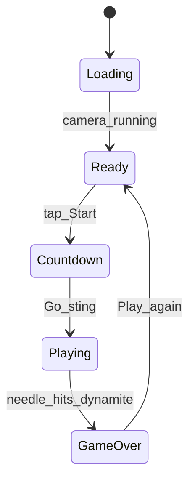
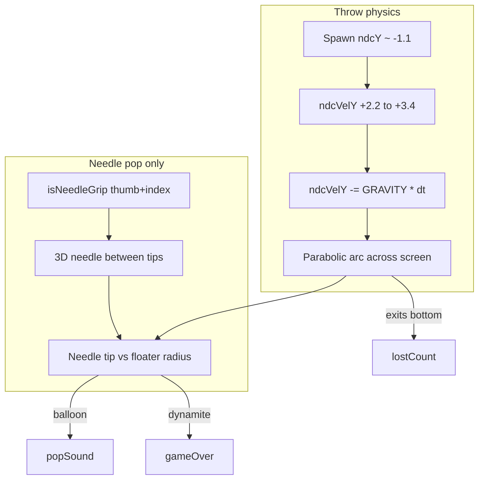

# 03 — Needle Pop Game Upgrade: Implementation Plan

**Stack:** React 18 + Vite + TypeScript + Three.js + 8th Wall XR8 (face) + MediaPipe Hands

**What you get at the end:** A proper AR mini-game — pinch thumb + index to hold a visible needle, pop balloons thrown up from the bottom of the screen (gravity arc), avoid dynamite, with a START screen, countdown, and sound effects. Finger pointing no longer pops balloons.

**Prerequisite:** Balloon mode is active (`AR_OBJECT_MODE = 'balloon'` in `src/config/arObjectMode.ts`).

---

## Architecture





| File | Single responsibility |
|---|---|
| `src/lib/handTracker.ts` | Needle grip gesture detection + grip point helpers |
| `src/lib/needleVisual.ts` | **New** — 3D needle mesh per hand, tip world position |
| `src/lib/gameSounds.ts` | **New** — start, countdown, whoosh, miss sounds |
| `src/lib/arObjectModule.ts` | Throw physics, needle hits, balloon visuals, game-active gate |
| `src/hooks/useXR8Face.ts` | Expose `startGame()` to React |
| `src/components/FaceTracking.tsx` | Start screen, countdown, phase machine |
| `src/components/FaceTracking.css` | Start/countdown UI styles |

---

## Current state

- Floaters spawn **from the top** and move down with constant `ndcY -= fallSpeed * dt` in `src/lib/arObjectModule.ts`.
- Popping uses **index extended / pointing** gestures via `fingerHitsFloater()`.
- Balloons use a lathe mesh + shine in `createBalloonMesh()` but lack latex texture/clearcoat.
- `FaceTracking.tsx` mounts XR8 immediately; score shows when `status === 'running'` — no start gate.
- Sounds exist only for pop (`bubblePopSound.ts`) and dynamite boom (`dynamiteExplosionSound.ts`).

---

## STEP 1 — Needle grip detection

**File:** `src/lib/handTracker.ts`

**Actions:**

1. Add `isNeedleGrip(landmarks)` — precision pinch pose:
   - Thumb tip (4) and index tip (8) distance `< palmSize * 0.22`
   - Middle, ring, pinky tips curled (closer to wrist than index tip)
   - Optional 1-frame stability debounce in the AR module
2. Add `needleGripPoints(landmarks, outBase, outTip)`:
   - Thumb base (3) and index tip (8) in normalized space
   - Extrapolate hit point ~35% past index along thumb→index axis
3. Keep existing exports; **stop using** `isIndexExtended` / `isPointing` for pop logic.

**Done when:** Pinch pose returns true; pointing alone returns false.

---

## STEP 2 — 3D needle visual

**File:** `src/lib/needleVisual.ts` (new)

**Actions:**

1. Create one `THREE.Group` per hand (max 2):
   - Thin metallic cylinder (~0.003 radius)
   - Sharp cone at tip
2. Export `updateNeedle(handIndex, landmarks, xrScene, video)`:
   - Map grip points to world space via `landmarkToWorld`
   - Orient mesh along pinch axis
   - Hide when `!isNeedleGrip`
3. Export `getNeedleTipWorld(handIndex)` for collision tests.
4. Wire into `arObjectModule.ts` `onUpdate` after hand detection each frame.

**Done when:** Pinching shows a silver needle between thumb and index; releasing hides it.

---

## STEP 3 — Needle-only pop (remove finger pop)

**File:** `src/lib/arObjectModule.ts`

**Actions:**

1. Rename `fingerHitsFloater` → `needleHitsFloater`.
2. Remove imports/usage of `isIndexExtended`, `isPointing`, `INDEX_TIP`.
3. Hit test only when `isNeedleGrip` for that hand.
4. Use needle tip world position at floater depth.
5. Hit radius: `floater.radius * 2.4` (balloons), `* 2.8` (dynamite).
6. Dynamite + needle → existing mega explosion + game over (unchanged).

**Done when:** Only needle contact pops; pointing finger does nothing.

---

## STEP 4 — Throw-from-bottom gravity physics

**File:** `src/lib/arObjectModule.ts`

**Actions:**

1. Extend `Floater` interface:

```ts
ndcVelY: number   // NDC units / second (+ = up)
ndcVelX?: number  // slight horizontal toss
nextSpawnAt?: number  // stagger respawns
```

2. Update spawn constants (balloon mode):

| Constant | Value | Purpose |
|---|---|---|
| `BALLOON_SPAWN_Y` | `{ min: -1.18, max: -1.02 }` | Below screen |
| `THROW_VEL_Y` | size-based `2.1–3.2` | Fast upward throw |
| `GRAVITY` | `~4.8` NDC/s² | Brings objects down |
| `THROW_VEL_X` | `±0.25` random | Slight arc spread |

3. In `spawnFloater`: set bottom `ndcY`, upward `ndcVelY`, random `ndcVelX`, play whoosh sound.
4. Replace constant fall with physics each frame:

```ts
floater.ndcVelY -= GRAVITY * dt
floater.ndcY += floater.ndcVelY * dt
floater.ndcX += (floater.ndcVelX ?? 0) * dt
floater.ndcVelX *= 1 - dt * 0.15  // air drag
```

5. Stagger throws: per-floater `nextSpawnAt` with 0.4–1.2s jitter so objects launch continuously, not all at once.
6. Lost rule: `ndcY < -1.2 && ndcVelY < 0` → `onLost()`, respawn with new throw.
7. Rotate balloon/dynamite group slightly from velocity for tumble during arc.

**Done when:** Balloons and dynamite launch from bottom, arc up, fall with gravity; lost count increments when they exit bottom unpopped.

---

## STEP 5 — More realistic balloons

**File:** `src/lib/arObjectModule.ts` — `createBalloonMesh()`

**Actions:**

1. Generate procedural canvas texture once (reused):
   - Soft radial gradient + noise for latex wrinkles
2. Switch body to `MeshPhysicalMaterial`:
   - `clearcoat: 0.85`, `clearcoatRoughness: 0.12`, `roughness: 0.35`, `sheen: 0.3`
   - Assign texture to `.map`
3. Add rim darkening (vertex colors or transparent shell toward `spec.rim`).
4. Add low-opacity inverted hull for internal depth.
5. Add faint second specular highlight opposite main shine.
6. Keep existing neck, knot, string.

No external asset files — all procedural in code.

**Done when:** Balloons look glossier and more latex-like with subtle surface variation.

---

## STEP 6 — Game sounds

**File:** `src/lib/gameSounds.ts` (new)

**Actions:**

1. Procedural Web Audio (same pattern as `bubblePopSound.ts`):
   - `playStart()` — bright two-note sting on START tap
   - `playCountdown(tick)` — 3, 2, 1 ticks + higher “GO”
   - `playWhoosh(scale)` — each floater throw from bottom
   - `playMiss()` (optional) — soft descending tone when balloon lost
2. Resume `AudioContext` on first user gesture (START click) for mobile.

**Done when:** Start, countdown, throw, and miss sounds play without external audio files.

---

## STEP 7 — Game start flow and UI

**Files:** `FaceTracking.tsx`, `FaceTracking.css`, `useXR8Face.ts`

**Actions:**

1. Add `gamePhase`: `'loading' | 'ready' | 'countdown' | 'playing' | 'gameover'`.

| Phase | UI |
|---|---|
| `loading` | Existing spinner |
| `ready` | Title overlay on live camera + instructions + animated START button |
| `countdown` | Large 3 → 2 → 1 → GO! (0.8s each) |
| `playing` | Score panel + AR gameplay |
| `gameover` | Existing BOOM overlay |

2. Flow:
   - XR8 boots on mount (camera permission unchanged)
   - When `status === 'running'` → show **ready** overlay (no score yet)
   - START tap → `playStart()` → countdown → `startGame()` → `playing`
   - Play again → remount session via existing `key` bump
3. Extend `ArObjectHandle` with `startGame(): void`.
4. Pass game-active flag into `createArObjectModule`; skip physics/spawns until `startGame()`.
5. `buildScene()` creates floaters hidden until game active.
6. CSS: title typography, gradient pulsing START button, countdown scale-in animation — match glass score panel aesthetic.

**Instructions copy:** “Pinch thumb + index to hold a needle · Pop balloons · Avoid dynamite!”

**Done when:** Game does not start until START; countdown plays; score appears only during play.

---

## Implementation order

| Order | Step | Depends on |
|---|---|---|
| 1 | STEP 1 — Needle grip detection | — |
| 2 | STEP 2 — 3D needle visual | STEP 1 |
| 3 | STEP 3 — Needle-only pop | STEP 1, 2 |
| 4 | STEP 6 — Game sounds | — |
| 5 | STEP 4 — Throw physics | STEP 6 (whoosh) |
| 6 | STEP 5 — Realistic balloons | — |
| 7 | STEP 7 — Start flow + UI | STEP 4, 6 |

---

## Testing checklist

1. Camera loads → title + START visible; no balloons flying yet.
2. START → countdown sounds → gameplay begins; objects launch from bottom with visible arc.
3. Pinch needle pose → silver needle appears; pointing alone does **not** pop.
4. Needle tip touches balloon → pop + sized pop sound; dynamite → boom + game over.
5. Balloon falls off bottom without pop → Lost increments + optional miss sound.
6. Play again remounts cleanly.
7. `npm run build` passes.

---

## Files touched (summary)

| File | Change |
|---|---|
| `src/lib/handTracker.ts` | `isNeedleGrip`, `needleGripPoints` |
| `src/lib/needleVisual.ts` | **New** — 3D needle per hand |
| `src/lib/gameSounds.ts` | **New** — start, countdown, whoosh |
| `src/lib/arObjectModule.ts` | Gravity throw, needle hits, balloon visuals, `startGame`, game-active gate |
| `src/hooks/useXR8Face.ts` | Expose `startGame` to React |
| `src/components/FaceTracking.tsx` | Start screen, countdown, phase machine |
| `src/components/FaceTracking.css` | Start/countdown styles |
